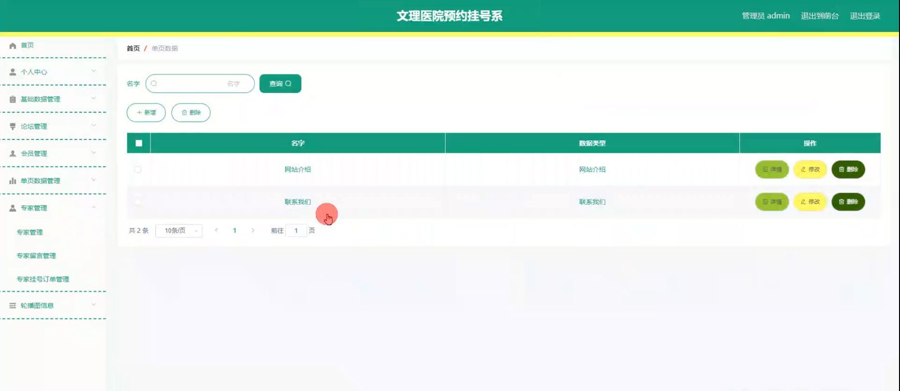

# 基于springboot的文理医院预约挂号系统

#### 介绍

基于Spring Boot的文理医院预约挂号系统是为了提升医院服务效率和患者满意度而开发的现代化信息管理系统。随着医疗需求的不断增长，传统的挂号方式已经无法满足患者的需求，尤其是在高峰时期，长时间的排队和复杂的挂号流程常常导致患者的不满。通过本系统，患者可以在线预约挂号，减少了等待时间，提升了就医体验。同时，系统提供了管理端、专家端和会员端三种角色，分别对应不同的权限和功能模块，以满足不同用户的需求。

#### 技术栈

后端技术栈：Springboot+Mysql+Maven

前端技术栈：Vue+Html+Css+Javascript+ElementUI

开发工具：Idea+Vscode+Navicate

#### 系统功能介绍

管理端功能模块：  
个人中心：  
个人信息管理：管理员可以查看和修改自己的个人信息，包括姓名、联系方式、密码等。  
通知公告：管理员可以接收系统通知和公告，及时了解系统更新和重要事项。  
基础数据管理：  
帖子类型管理：管理员可以管理论坛帖子类型，包括添加、修改和删除帖子类型。  
科室管理：管理员可以管理医院科室信息，包括添加、修改和删除科室。  
时间段管理：管理员可以管理预约时间段，确保挂号时间的合理安排。  
职位管理：管理员可以管理医院职位信息，包括添加、修改和删除职位。  
论坛管理：  
帖子管理：管理员可以管理论坛帖子，包括审核、删除和置顶帖子。  
评论管理：管理员可以管理帖子评论，确保论坛的健康交流。  
会员管理：  
会员信息管理：管理员可以管理会员信息，包括添加、修改和删除会员。  
会员权限管理：管理员可以设置会员的权限，确保会员只能访问和操作与其权限相关的功能模块。  
单页数据管理：  
网站单页管理：管理员可以管理网站的单页信息，包括网站介绍、联系我们等页面内容。  
专家管理：  
专家信息管理：管理员可以管理专家信息，包括添加、修改和删除专家。  
专家留言管理：管理员可以查看和管理患者对专家的留言，确保专家能够及时回复。  
专家挂号订单管理：管理员可以查看和管理专家的挂号订单，确保挂号流程的顺利进行。  
轮播图信息：  
轮播图管理：管理员可以管理网站首页的轮播图，包括添加、修改和删除轮播图。  

专家端功能模块：  
论坛模块：  
帖子管理：专家可以发布和管理自己的帖子，与患者进行交流。  
评论管理：专家可以查看和回复患者的评论，提供专业的解答。  
网站介绍：  
医院介绍：专家可以查看医院的基本介绍，了解医院的背景和文化。  
联系我们模块：  
联系方式：专家可以查看医院的联系方式，方便与医院管理人员沟通。  
专家模块：  
个人信息管理：专家可以查看和修改自己的个人信息，包括姓名、联系方式、职称等。  
预约管理：专家可以查看和管理患者的预约信息，合理安排就诊时间。  
个人中心：  
个人信息管理：专家可以查看和修改自己的个人信息，包括姓名、联系方式、密码等。
通知公告：专家可以接收系统通知和公告，及时了解系统更新和重要事项。  
后台管理：  
论坛管理：专家可以发布和管理自己的帖子，与患者进行交流。  
专家管理：  
专家留言管理：专家可以查看和回复患者的留言，提供专业的解答。  
专家挂号订单管理：专家可以查看和管理自己的挂号订单，确保挂号流程的顺利进行。  

会员端功能模块：  
论坛模块：  
帖子浏览：会员可以浏览论坛帖子，与其他患者和专家进行交流。  
评论互动：会员可以对帖子进行评论，与其他用户互动。  
网站介绍：  
医院介绍：会员可以查看医院的基本介绍，了解医院的背景和文化。  
联系我们模块：  
联系方式：会员可以查看医院的联系方式，方便与医院管理人员沟通。  
专家模块：  
专家信息查询：会员可以查看专家的详细信息，包括姓名、职称、擅长领域等。  
预约挂号：会员可以在线预约专家的挂号服务，选择合适的时间段进行就诊。  
专家留言：会员可以给专家留言，咨询相关问题，获得专家的专业建议。  
个人中心：  
个人信息管理：会员可以查看和修改自己的个人信息，包括姓名、联系方式、密码等。  
预约记录查询：会员可以查看自己的预约挂号记录，了解预约详情和状态。  
通知公告：会员可以接收系统通知和公告，及时了解系统更新和重要事项。  
后台管理：  
论坛管理：会员可以发布和管理自己的帖子，与其他用户和专家进行交流。  
专家管理：  
专家模块：会员可以查看和管理自己关注的专家信息，方便快速预约和咨询。  
专家留言管理：会员可以查看和回复自己给专家的留言，跟进咨询进展。  
专家挂号订单管理：会员可以查看和管理自己的挂号订单，确保挂号流程的顺利进行。  
#### 系统作用

提升服务效率：通过在线预约挂号，减少了患者在医院排队等待的时间，提高了医院的服务效率。  
优化患者体验：患者可以通过系统方便地查询专家信息、预约挂号和咨询问题，提升了就医体验。  
加强信息管理：系统实现了医院科室、专家、会员等信息的集中管理，减少了人工操作，提高了数据的准确性和一致性。  
促进医患互动：通过论坛和留言功能，患者可以与专家进行互动，获得专业的医疗建议，增强了医患关系。  
数据统计与分析：系统提供了预约和挂号数据的统计与分析功能，帮助医院管理者了解业务状况，制定科学的运营策略。  
权限管理：系统通过角色权限管理，确保不同角色只能访问和操作与其职责相关的功能模块，增强了系统的安全性和数据的保密性。  

#### 系统功能截图

代码结构

数据库表

登录

前台页面首页

论坛模块

专家模块

联系我们模块

个人中心

管理员端基础数据管理

论坛管理

会员管理

单页数据管理

专家管理

专家端后台管理

会员端后台管理

#### 总结

基于Spring Boot的文理医院预约挂号系统在提升医院服务效率和患者满意度方面具有重要意义。随着医疗需求的不断增长，传统的挂号方式已经难以满足现代化医疗服务的需求。通过本系统，医院可以实现科室、专家、会员等信息的集中管理，优化服务流程，提升患者的就医体验。
然而，尽管本系统在提升医疗服务效率方面取得了显著成效，但仍存在一些局限性。例如，系统的可扩展性和灵活性可能需要进一步提升，以适应不断变化的业务需求。此外，系统的用户界面和用户体验也有待进一步优化，以提高用户的使用满意度。
未来，随着技术的不断进步和业务需求的不断变化，本系统将不断进行优化和升级，以更好地满足医疗行业的信息化管理需求。通过持续的技术创新和用户反馈，我们相信本系统将为医疗服务带来更大的价值和贡献。

#### 使用说明

创建数据库，执行数据库脚本 修改jdbc数据库连接参数 下载安装maven依赖jar 启动idea中的springboot项目

前台登录页面
http://localhost:8080/wenlixueyuanyuyueguahao/front/index.html

后台登录页面
http://localhost:8080/wenlixueyuanyuyueguahao/admin/dist/index.html

管理员				账户:admin 		密码：admin

会员 show2 photoShow				账户:a3 		密码：123456

专家				账户:a1 		密码：123456